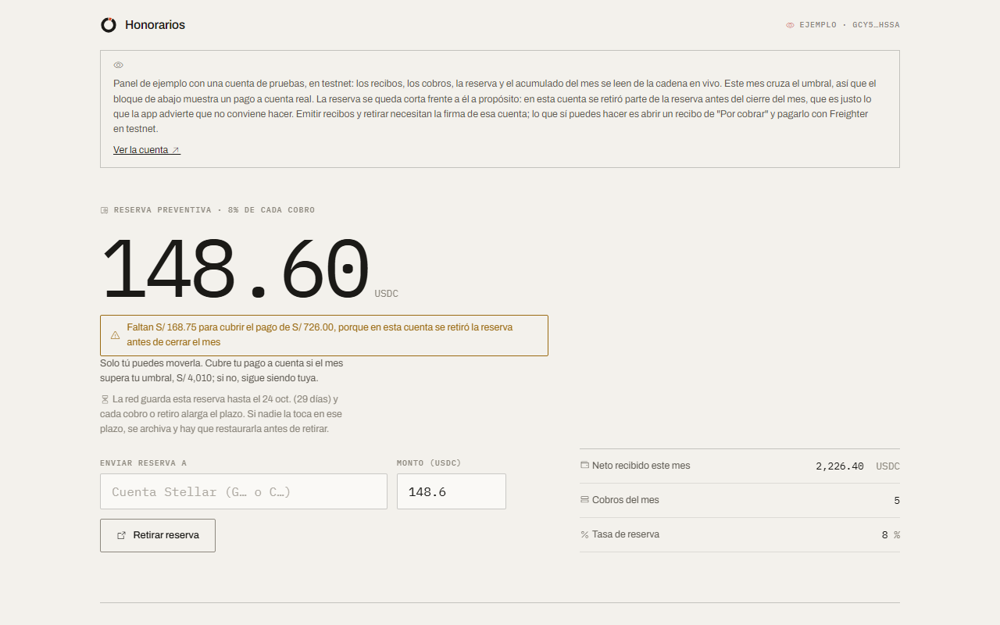
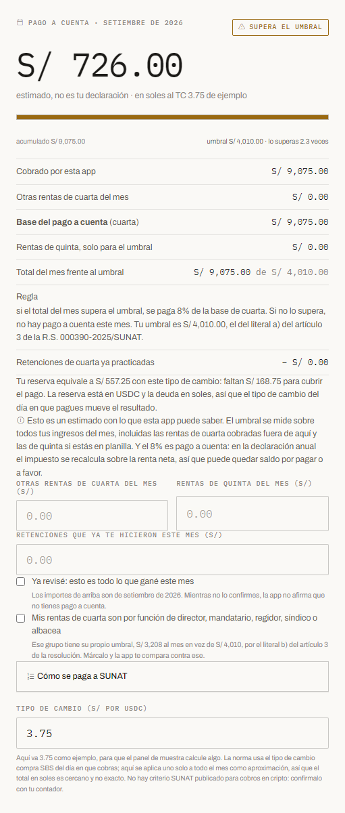
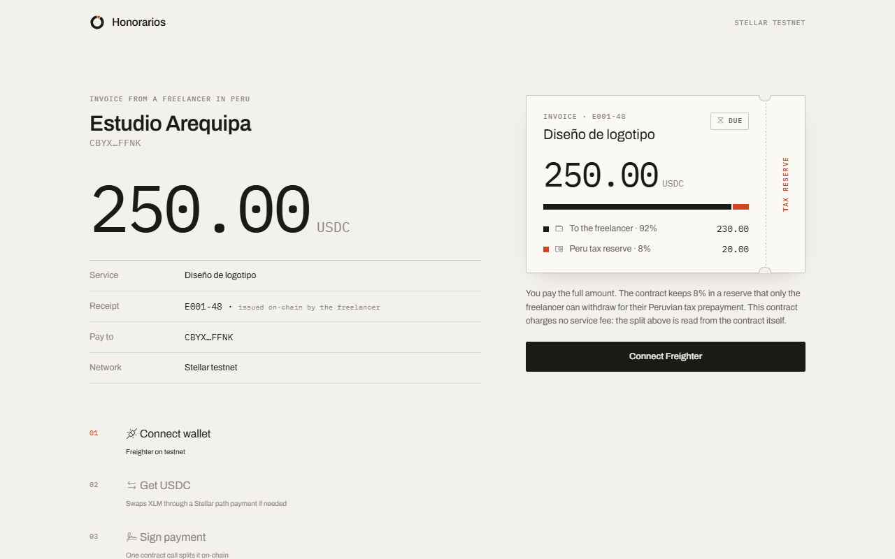
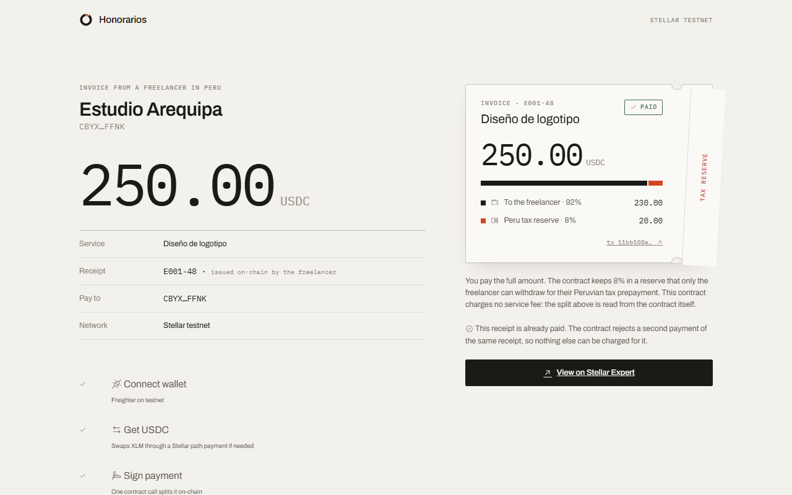
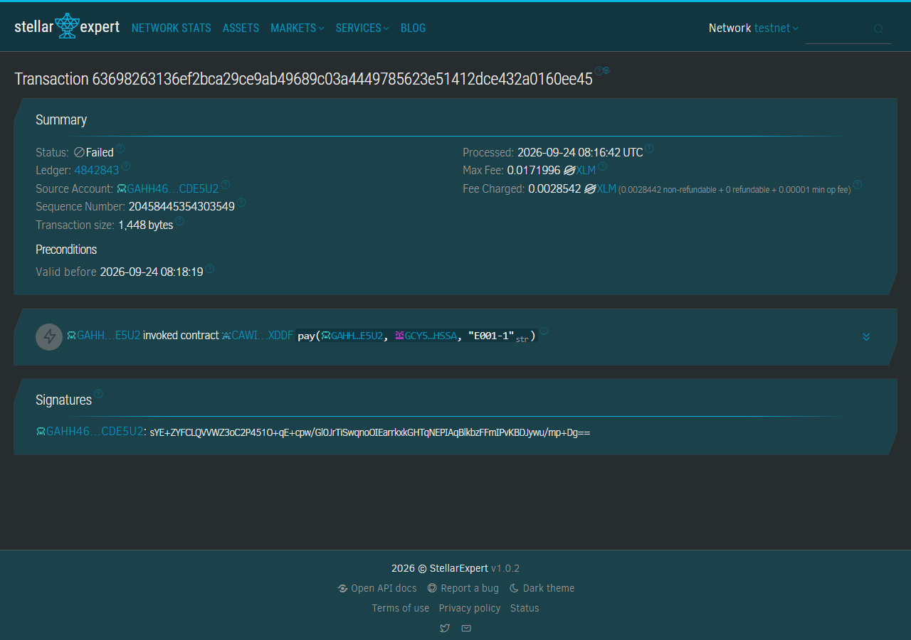

<p></p>

# Honorarios

Honorarios aparta el 8% de cada cobro del exterior para que el freelancer peruano tenga listo su pago a cuenta de SUNAT (el adelanto mensual del impuesto a la renta de cuarta categoría, que le toca pagar por su cuenta cuando su cliente no le retiene).

**App:** https://honorarios-pe.vercel.app · **Panel de ejemplo, sin wallet ni instalación, carga en unos 3 segundos:** https://honorarios-pe.vercel.app/?demo · **Video (2:38):** https://youtu.be/L0_wNoNNIJ0 · **Red:** Stellar testnet · **Track:** Real-World Assets & Compliant Rails

El panel de ejemplo lee en vivo una cuenta de pruebas. Al 24 de septiembre llevaba cobrados en el mes 2,420 USDC (S/ 9,075 al tipo de cambio de ejemplo de 3.75): muestra el pago a cuenta que le toca, S/ 726, la reserva que tiene para cubrirlo y un recibo pendiente que puedes abrir y pagar. Las cifras cambian si alguien paga ese recibo.

Proyecto para la hackathon Stellar Odyssey Perú (19 al 26 de septiembre de 2026). Todo el código se escribió durante el evento: [historial de commits](https://github.com/kasbsquall/honorarios/commits/main).

## Problema

Un caso de ejemplo: una diseñadora en Arequipa cobra US$ 1,500 al mes a una agencia de Madrid. Son unos S/ 5,625 a un tipo de cambio de 3.75, por encima del umbral mensual de S/ 4,010, así que ese mes debe adelantar a SUNAT el 8% de lo cobrado, S/ 450. Nadie se lo retiene, porque su cliente está en el extranjero, y el pago lo tiene que hacer ella (artículo 86 del TUO de la LIR; el umbral es el del artículo 3.a de la [R.S. 000390-2025/SUNAT](https://www.sunat.gob.pe/legislacion/superin/2025/000390-2025.pdf), con copia en `evidencias/`). Lo común es que cuando llega la fecha ese dinero ya se gastó, porque llegó mezclado con el resto del cobro.

## Solución

El freelancer emite su recibo en la app y le manda el link a su cliente. Cuando el cliente paga, un contrato en Stellar reparte el dinero en el mismo momento: el 92% llega a la wallet del freelancer y el 8% queda reservado a su nombre dentro del contrato, listo para el pago a cuenta.

1. El freelancer crea su wallet con la huella o Face ID de su teléfono o computadora. No hay frase semilla que guardar y no paga comisiones de red.
2. Llena monto, N° de recibo y concepto, y firma el recibo. El recibo queda registrado en el contrato y la app le da el link de cobro.
3. El cliente abre el link, ve el recibo tal como está en la cadena y paga una sola vez ese monto. Si no tiene USDC, la app se lo compra con XLM en el camino.
4. El contrato reparte 92/8 en esa misma transacción y marca el recibo como pagado.
5. El panel muestra lo cobrado en el mes, calcula si se cruzó el umbral (S/ 4,010 en el caso general, o S/ 3,208 para director, síndico, mandatario, gestor de negocios, albacea o regidor), estima el pago a cuenta, explica cómo se paga en SUNAT (Formulario Virtual 616, en soles) y arma el borrador del recibo por honorarios para copiarlo en SUNAT.

**Solo el freelancer puede mover su reserva.** El contrato no tiene administrador ni función de actualización, y el retiro exige la firma del titular: nadie más, tampoco nosotros, puede tocar ese dinero. La app tampoco guarda llaves en ningún servidor.

Los links de cobro con cripto ya existen. Lo que agrega Honorarios es lo que pasa dentro del cobro: la reserva del 8%, el recibo registrado y el umbral de SUNAT.

**Por qué en la cadena y no en una cuenta aparte.** Separar el impuesto al cobrar también se hace con una cuenta aparte en un banco o una fintech (ver [Qué de esto ya existe](#qué-de-esto-ya-existe)). Aquí la separación la hace el propio pago: el cliente del exterior paga en USDC desde su wallet de Stellar, sin cuenta en un banco peruano, y el contrato aparta el 8% en esa misma transacción, antes de que el dinero llegue a la wallet del freelancer. El recibo que se cobra también está en la cadena: su monto lo fijó el freelancer al firmarlo, el cliente lo ve antes de pagar y se paga una sola vez. La reserva no depende de confiar en nosotros: solo el titular la puede mover, y el código desplegado se puede comparar byte a byte con el de este repositorio ([cómo](#verifica-que-el-contrato-desplegado-es-este-código)).

Lo que el contrato no hace es obligar al freelancer a pagarle a SUNAT: la reserva es suya y la puede retirar cuando quiera. Bloquearla hasta el vencimiento es posible, pero dejaría el dinero de terceros retenido por un servicio, con las consecuencias regulatorias que se explican en [Lo que este proyecto no ha resuelto](#lo-que-este-proyecto-no-ha-resuelto).

## Cómo se ve

Capturas del dominio público tomadas en un recorrido de prueba en producción el 24 de septiembre. Los tiempos medidos de cada paso están en [docs/demo-en-vivo.md](docs/demo-en-vivo.md).

| Panel de ejemplo: un mes que cruza el umbral | Estimado del pago a cuenta en soles |
|---|---|
|  |  |

| Lo que ve el cliente: monto y concepto leídos del recibo en la cadena | El mismo link después del pago: el contrato no acepta un segundo pago |
|---|---|
|  |  |

Y así se ve en Stellar Expert uno de los ataques rechazados, el segundo pago del recibo E001-1:



## Cómo te paga tu cliente del exterior

Hoy, en testnet, con una wallet de Stellar en su navegador (Freighter) y USDC o XLM. Si solo tiene XLM, la app arma un path payment que compra los USDC que faltan en la misma operación. Un cliente que nunca usó cripto necesita antes una forma de convertir sus dólares a USDC sobre Stellar; esa pieza no la resuelve esta app y está en la lista de lo pendiente.

## De la reserva a SUNAT, en soles

SUNAT recibe soles. En la red principal eso lo hace un ancla que liquida soles por SEP-24; el panel consulta en vivo el `stellar.toml` de Anclap ("Sol Digital", PEN) y lo muestra en el paso 1 de "Cómo se paga a SUNAT". Esa ancla opera en la red principal, así que desde testnet no se retira a un banco peruano.

Lo que sí corre en testnet es el mismo camino con el ancla de pruebas de SDF, que acepta el USDC de Circle y simula la salida a un banco (sin soles ni banco real). Con una cuenta conectada por Freighter, el paso 1 ejecuta el retiro completo:

1. La wallet se identifica ante el ancla firmando su reto (SEP-10).
2. El ancla abre su formulario de retiro (SEP-24) y el freelancer pone ahí sus datos.
3. El freelancer firma dos veces: retira la reserva del contrato a su cuenta y envía el USDC al ancla con la referencia que el ancla pidió.
4. El panel sigue el estado del ancla hasta que marca el retiro como completado.

Corrida del 24 de septiembre, 5 USDC (el ancla de pruebas acepta de 1 a 10 por retiro): retiro de la reserva [`ab823589…9e6c`](https://stellar.expert/explorer/testnet/tx/ab8235898915356276d3e59d23a5fec6915b75e2f2df31cb10fab3a8e3029e6c) y envío al ancla [`ab6c7806…e39b`](https://stellar.expert/explorer/testnet/tx/ab6c7806f6cd8bacaffdd777ad0a34ca5fa75db4d6cd1c20c5cf95782153e39b). El guion es `web/e2e/sep24.mjs`. Una wallet con passkey necesitaría la autenticación para contratos del ancla (SEP-45), que no está conectada.

## Cómo usa Stellar

| Pieza | Para qué |
|---|---|
| **Soroban** (contrato `split`) | Recibos emitidos por el freelancer, reparto 92/8, reserva por freelancer, autorización del retiro, eventos `Issued`, `Paid` y `TaxWithdrawn` |
| **USDC de Circle** vía Stellar Asset Contract | Moneda del cobro |
| **Path payments** (`path_payment_strict_receive`) | El cliente paga aunque solo tenga XLM |
| **Smart accounts de OpenZeppelin + passkeys** (secp256r1, `smart-account-kit`) | Wallet del freelancer sin frase semilla |
| **Relayer de SDF** (OpenZeppelin Channels) | Patrocina las comisiones de la smart wallet |
| **SEP-10 y SEP-24** con el ancla de pruebas de SDF | Retiro de la reserva hasta un banco simulado, de punta a punta en testnet |
| **RPC `getEvents` y `getLedgerEntries`** | El panel reconstruye recibos y cobros desde la cadena, sin base de datos, y lee hasta cuándo vive la reserva |

## Controles de cumplimiento (track 03)

El track pide activos reales con controles legales y pone las facturas como ejemplo. Aquí el activo es el recibo por honorarios, el comprobante con el que un freelancer cobra, que cumple ese mismo papel. Vive en el contrato con su estado: lo emite y firma el freelancer con un monto fijo, y se paga una sola vez con el dinero que llega del exterior. El control legal es el pago a cuenta de cuarta categoría. Cada fila dice dónde se hace cumplir; si la regla vive en el contrato, la aplica la red y nadie la puede saltar desde la app.

| Control | Cómo se cumple | Dónde |
|---|---|---|
| Ningún cobro sin reserva | El 8% del bruto se aparta en la misma transacción del pago. No existe una ruta de cobro que lo omita | [`lib.rs:229`](contracts/split/src/lib.rs#L229), tasa en `TAX_BPS` ([`lib.rs:10`](contracts/split/src/lib.rs#L10)) |
| La duda favorece a la reserva | El 8% se redondea hacia arriba y la comisión hacia abajo | [`lib.rs:228`](contracts/split/src/lib.rs#L228), test `the_reserve_rounds_up` |
| Solo se cobra lo que el freelancer emitió | Emitir un recibo exige su firma, y `pay` rechaza un N° que nadie emitió | [`lib.rs:163`](contracts/split/src/lib.rs#L163) y [`lib.rs:212`](contracts/split/src/lib.rs#L212), tests `issue_requires_the_freelancer_signature` y `rejects_paying_a_receipt_nobody_issued` |
| El monto lo fija el recibo | El cliente no dice cuánto paga: el contrato cobra lo registrado. Editar el link no cambia nada | test `pay_reads_the_amount_from_the_receipt` |
| Un recibo se paga una vez | Un segundo pago del mismo N° es rechazado, y un N° no se puede reemitir con otro monto | [`lib.rs:213`](contracts/split/src/lib.rs#L213) y [`lib.rs:180`](contracts/split/src/lib.rs#L180), tests `a_receipt_cannot_be_paid_twice` y `rejects_issuing_the_same_receipt_twice` |
| Nadie ajeno infla el mes | Como solo el freelancer emite, un extraño no puede sumar cobros a su acumulado mensual | test `a_stranger_cannot_issue_receipts_in_someone_elses_name` |
| Solo el titular retira su reserva | El retiro exige la firma del freelancer. Un tercero que firma por sí mismo es rechazado | [`lib.rs:286`](contracts/split/src/lib.rs#L286), tests `withdraw_requires_the_freelancer_signature` y `a_third_party_cannot_withdraw_someone_elses_reserve` |
| No se retira más de lo reservado | El contrato rechaza un retiro mayor al saldo | [`lib.rs:292`](contracts/split/src/lib.rs#L292), test `cannot_withdraw_more_than_reserve` |
| El mes tributario es el de Lima | El acumulado mensual cierra a medianoche de Lima, no en UTC | `period_of` en [`lib.rs:56`](contracts/split/src/lib.rs#L56), test `the_month_closes_at_midnight_in_lima` |
| Umbrales citados, no derivados | S/ 4,010 al mes en el régimen general y S/ 3,208 para el literal b), con sus topes anuales, copiados del artículo 3 de la R.S. 000390-2025/SUNAT. La app enlaza la resolución en pantalla | [`tax.ts:22`](web/src/tax.ts#L22) |
| La comisión tiene tope y no toca la reserva | Se fija al desplegar. El constructor rechaza más de 1% | [`lib.rs:137`](contracts/split/src/lib.rs#L137), tests `rejects_a_fee_above_the_cap` y `the_tax_reserve_is_never_touched_by_the_fee` |
| Borrador del comprobante | La app arma el recibo por honorarios para copiar en SUNAT Operaciones en Línea. No emite ni envía nada a SUNAT | [`rhe.ts`](web/src/rhe.ts) |

Las autorizaciones se prueban con el entorno en modo estricto, sin ninguna firma concedida (`set_auths(&[])`). Lo que el contrato no puede ver, las rentas cobradas fuera de la app, lo pide el panel a mano: está en [Límites conocidos](#límites-conocidos).

## Compruébalo tú: cinco ataques que la red rechazó

Enviados de verdad a testnet contra el contrato vigente. Cada uno aparece en Stellar Expert como transacción fallida, con la llamada y los argumentos a la vista. El error sale de los eventos de diagnóstico del RPC.

| Intento | Transacción | Error |
|---|---|---|
| Un tercero intenta retirar la reserva del freelancer firmando por sí mismo | [`c53e7694…4fa5`](https://stellar.expert/explorer/testnet/tx/c53e7694b8644a4062e5a45b108de5311494eecef70a7e47c63ccbf29ddf4fa5) | `Error(Auth, InvalidAction)` |
| El freelancer intenta retirar una unidad más de lo reservado | [`14e63df7…a208`](https://stellar.expert/explorer/testnet/tx/14e63df7fefb5e09f72868b859320b5ddde2c6c268da575e2e01dc1d52f9a208) | `Error(Contract, #2)`, reserva insuficiente |
| Un extraño emite un recibo de 5,000 USDC a nombre del freelancer para inflar su mes | [`6eb4fc4c…bb2d`](https://stellar.expert/explorer/testnet/tx/6eb4fc4c1b1acffb8250ce34dd0bb845906f8ac669b7e7aa9410f9e5a6ccbb2d) | `Error(Auth, InvalidAction)` |
| El cliente intenta pagar un recibo que nadie emitió | [`912ebbc8…9df0`](https://stellar.expert/explorer/testnet/tx/912ebbc85c90db2836aa5ceee6ea634f58a84ba64f72fbf51b5ea709449c9df0) | `Error(Contract, #7)`, recibo desconocido |
| El cliente intenta pagar dos veces el mismo recibo | [`63698263…e45`](https://stellar.expert/explorer/testnet/tx/63698263136ef2bca29ce9ab49689c03a4449785623e51412dce432a0160ee45) | `Error(Contract, #8)`, ya pagado |

Para repetirlos, con dos cuentas de testnet en `web/.env.development.local` (ver `web/.env.example`):

```sh
cd web
node scripts/seed-demo.mjs    # recibos, cobros y un retiro válidos
node scripts/rejections.mjs   # los cinco ataques; imprime hash, estado y error de cada uno
```

## Verifica que el contrato desplegado es este código

El contrato no tiene administrador ni función de actualización: no hay ninguna en [`lib.rs`](contracts/split/src/lib.rs). Para comprobar que lo desplegado en testnet es ese mismo código, compila el repositorio y compara el resultado con el WASM que guarda la red:

```sh
git clone https://github.com/kasbsquall/honorarios && cd honorarios
stellar contract build
sha256sum target/wasm32v1-none/release/split.wasm
stellar contract fetch --id CAWIYCJAOXFIL5XHIIXK34XOSLSFTLUU5LP6JEL65QECGZM5WATUXDDF --network testnet -o desplegado.wasm
sha256sum desplegado.wasm
```

Los dos dan `14602007fd438ffbbb144962cb37c6a03bb576e16cb336219c450a603c7853df`. Lo comprobamos el 25 de septiembre desde un clon limpio, con rustc 1.97.1 y stellar-cli 28.0.0; otra versión del compilador puede producir bytes distintos a partir del mismo código.

## Evidencia on-chain (testnet)

**Contrato vigente**, con recibos en la cadena: [`CAWIYCJA…XDDF`](https://stellar.expert/explorer/testnet/contract/CAWIYCJAOXFIL5XHIIXK34XOSLSFTLUU5LP6JEL65QECGZM5WATUXDDF), desplegado en [`471d45ca…7e41`](https://stellar.expert/explorer/testnet/tx/471d45ca39453b968d1f0ce90af83719661f75030887d18e35b3b5e3547f7e41).

| Qué | Enlace |
|---|---|
| Recibo E001-1 emitido por el freelancer, 500 USDC | [`e5b157ec…4d01`](https://stellar.expert/explorer/testnet/tx/e5b157ecba4b2d608610b3642b4dec111c0e2ac88842a58fe275c8ae6f564d01) |
| Pago de E001-1: 460 al freelancer, 40 a la reserva | [`0fcccf3b…c68f`](https://stellar.expert/explorer/testnet/tx/0fcccf3bf36bcee412c70f5ff72e2828a815360c60282c539a67c2627d19c68f) |
| Retiro de 40 USDC de la reserva | [`3832f863…426f`](https://stellar.expert/explorer/testnet/tx/3832f863b2e8d13b83a076d7dc92d88393041f00ed7360265cd9ce8a362f426f) |
| Recibo emitido con passkey desde una smart wallet | [`3ca133a0…17a7`](https://stellar.expert/explorer/testnet/tx/3ca133a095cf45f41500aa1061dfa2e89b30bedc71fc732ff92f33402c6917a7) |
| Pago de ese recibo y retiro firmado con passkey | [`51f402ea…8f10`](https://stellar.expert/explorer/testnet/tx/51f402ea6f6389cfff25e686b95bd58fc32d11fc6751f9a08d5c4a5713ce8f10), [`55d10bf3…1866`](https://stellar.expert/explorer/testnet/tx/55d10bf3a29f5f8d766c350544090787b74d7c195c316160e1e3b36748451866) |

La cuenta del panel de ejemplo es [`GCY5…HSSA`](https://stellar.expert/explorer/testnet/account/GCY5LQWZD36VIBSH6PSJOHJK4F3LSNFPTMJMRH7UWKI5L4PPKCXZHSSA). Al 24 de septiembre tenía cinco recibos pagados en el mes (500, 620, 300, 500 y 500 USDC: 2,420 USDC, S/ 9,075 al tipo de cambio de ejemplo de 3.75, con un pago a cuenta de S/ 726) y uno pendiente, E001-4 por 180 USDC. Su reserva, 148.60 USDC o S/ 557.25, se queda corta frente a ese pago porque se retiraron 45 USDC antes del cierre del mes (40 a su cuenta y 5 por el ancla de pruebas), que es justo lo que la app advierte que no conviene hacer. La lista completa de hashes está en [`evidencias/2026-09-24-contrato-v3/origen.md`](evidencias/2026-09-24-contrato-v3/origen.md).

**La corrida del video** es anterior al recibo en la cadena: usa el contrato v2, [`CCTU5SUS…X3EU`](https://stellar.expert/explorer/testnet/contract/CCTU5SUST4I6O5JIO6UHRGI2NW6FHWFNHVRGWPTKCGKCY7Z4X3CMX3EU), donde el link llevaba el monto y el freelancer no firmaba nada al crearlo. Esa corrida sigue verificable de principio a fin: la wallet se crea en el minuto 0:31 del video ([`CATN…J5FR`](https://stellar.expert/explorer/testnet/contract/CATNE6YKD72P5OTSW5N6U3SR7AOAQ7R5GQYVX66B6VKV5IDIY6R7J5FR)), el cobro de 500 USDC es [`4668b6f3…c8f9`](https://stellar.expert/explorer/testnet/tx/4668b6f344a715d3cdd3f943ff398873c657241a3fb8ffed1efe4c3efc03c8f9) y el retiro con passkey del minuto 1:48 es [`b47aa15e…d913`](https://stellar.expert/explorer/testnet/tx/b47aa15ee86b4df29336159ee89d5fad2b441afae61cf9037eb38d73782d913e).

USDC testnet (Circle): `USDC:GBBD47IF6LWK7P7MDEVSCWR7DPUWV3NY3DTQEVFL4NAT4AQH3ZLLFLA5`, SAC `CBIELTK6YBZJU5UP2WWQEUCYKLPU6AUNZ2BQ4WWFEIE3USCIHMXQDAMA`.

## Arquitectura

Diagramas de componentes, flujo de cobro y retiro: [docs/arquitectura.md](docs/arquitectura.md).

```
contracts/split/   contrato Soroban (Rust) y sus 31 tests
web/               frontend (Vite + TypeScript): pay.html y panel
web/src/tax.ts     estimación del pago a cuenta, aislada de la interfaz y con sus tests
web/scripts/       seed del panel de ejemplo, ataques rechazados y check-demo
web/e2e/           guiones de Playwright que ejecutan el flujo en testnet y lo graban
design/            tres propuestas de identidad visual
docs/              arquitectura, bitácora de decisiones, recorrido de prueba en producción y capturas
```

## Contrato

| Función | Autoriza | Qué hace |
|---|---|---|
| `issue(freelancer, receipt_ref, gross, concept)` | `freelancer` | Registra el recibo con su monto y concepto. Un N° se emite una vez. Evento `Issued` |
| `receipt(freelancer, receipt_ref)` | lectura | El recibo: monto, concepto y si ya se pagó |
| `pay(payer, freelancer, receipt_ref)` | `payer` | Cobra el monto del recibo: 8% a la reserva, la comisión del servicio si la hay, el resto al freelancer. Marca el recibo como pagado. Evento `Paid` |
| `fee()` | lectura | Comisión del servicio con la que se desplegó el contrato, y a dónde va |
| `tax_reserve(freelancer)` | lectura | Saldo reservado |
| `month_gross(freelancer, period)` | lectura | Bruto cobrado en un mes, para comparar con el umbral |
| `current_period()` | lectura | Periodo tributario del ledger actual |
| `withdraw_tax(freelancer, to, amount)` | `freelancer` | Mueve la reserva, evento `TaxWithdrawn` |
| `extend_reserve(freelancer)` | nadie | Renueva el TTL de la reserva sin mover fondos. El panel la ofrece cuando le quedan 10 días o menos |

Errores: `InvalidAmount` (1), `InsufficientReserve` (2), `InvalidParty` (3), `ReceiptRefTooLong` (4), `FeeTooHigh` (5), `ReceiptExists` (6), `UnknownReceipt` (7), `AlreadyPaid` (8), `ConceptTooLong` (9) y `EmptyReceiptRef` (10). La reserva, el recibo y el acumulado del mes renuevan su TTL en cada operación que los toca.

## Ejecutar

Contrato:

```sh
rustup target add wasm32v1-none
cargo test
stellar contract build
stellar contract deploy --wasm target/wasm32v1-none/release/split.wasm \
  --source-account <cuenta> --network testnet -- \
  --token CBIELTK6YBZJU5UP2WWQEUCYKLPU6AUNZ2BQ4WWFEIE3USCIHMXQDAMA \
  --fee_bps 0 --fee_to <cuenta que recibiria la comision>
```

Frontend:

```sh
cd web && npm install && npm run dev
npm test     # 31 tests: estimación del pago a cuenta y reparto del cobro
```

El link de cobro apunta al dominio de `VITE_PUBLIC_BASE` (ver `web/.env.example`), no a la máquina desde la que se genera: lo recibe un cliente en el extranjero.

Guiones de recorrido en testnet, sin aserciones: sirven para grabar y para comprobar a ojo que el flujo completo sigue funcionando. Usan un firmante de desarrollo que solo existe con `npm run dev` y lee llaves de testnet desde `web/.env.development.local` (fuera del repo):

```sh
node web/e2e/record.mjs    # recibo firmado y cobro con Freighter
node web/e2e/passkey.mjs   # passkey con autenticador WebAuthn virtual: wallet, recibo, cobro y retiro
node web/e2e/demo.mjs      # recorrido completo, grabado sin cortes para el video
node web/e2e/sep24.mjs     # retiro de la reserva por el ancla de pruebas de SDF
node web/e2e/ensayo.mjs    # recorrido de prueba contra el dominio público, con tiempos y capturas
```

`node scripts/check-demo.mjs`, desde `web/` y también en CI, comprueba que la cuenta del panel de ejemplo cobró en el contrato vigente. Existe porque un redespliegue dejó esa constante apuntando a un contrato muerto y el panel mostró ceros hasta que alguien lo abrió.

## Trabajo hecho durante el evento

Todo el repositorio. El [historial de commits](https://github.com/kasbsquall/honorarios/commits/main) empieza el 19 de septiembre de 2026 y [docs/bitacora.md](docs/bitacora.md) registra cada decisión con su fuente: elección del proyecto, tasa y umbral tributario, liquidez de USDC en testnet, passkeys, revisión de seguridad, los redespliegues del contrato y el paso del recibo a la cadena.

## Cómo se sostiene

**0.5% por cobro liquidado, sin cuota mensual.** Con los supuestos de [docs/negocio.md](docs/negocio.md), Perú solo da entre US$ 10,500 y US$ 67,000 al año: es un negocio de una persona, y lo decimos. El caso grande es que el pago a cuenta sin agente de retención es el mismo problema en México, Colombia y Argentina, donde hay un orden de magnitud más de freelancers dolarizados. El rail de Stellar no cambia entre países; lo que se reescribe es el contrato y la norma que cita. Perú es la cuña.

El contrato puede cobrar esa comisión: sale del bruto junto al neto y la reserva, tiene un tope duro de 1% que el constructor rechaza superar, el evento `Paid` publica cuánto se cobró y la página de pago la lee con `fee()` y la muestra desglosada antes de que el cliente firme. La reserva del 8% nunca se toca con la comisión.

**Este contrato está desplegado con la comisión en cero**, porque durante la hackathon no se cobra nada. El 0.5% es una propuesta sin validar: no hemos hecho ni una entrevista de precio. El contrato es MIT.

## Qué de esto ya existe

Apartar un porcentaje para el impuesto en el momento del cobro no es una idea nueva. En Estados
Unidos lo hacen [Found](https://found.com/taxes) y Lili partiendo cada depósito al entrar, y
[Qapital](https://www.qapital.com/blog/qapital-freelancer-rule-taxes/) lo tiene como regla desde
2015. Found además paga los estimados trimestrales al IRS desde dentro de la app, que es justo la
pieza que aquí falta. En cripto, los contratos de reparto de pagos con envío de una parte a una
segunda dirección llevan años funcionando en EVM, y en Stellar hay proyectos de reparto y de
nómina para freelancers.

Lo que no encontramos hecho es la parte peruana: la tasa del 8% y el mes tributario que cierra a
medianoche de Lima dentro del contrato, los cuatro umbrales del artículo 3 de la resolución
citados con su número en vez de derivados de la UIT, el caso del inciso b) del artículo 33 con su
umbral propio, y el recibo por honorarios registrado antes del cobro. Eso es localización, no una
primitiva nueva, y conviene decirlo así: el mecanismo está resuelto en otras partes y lo que aporta
este proyecto es aterrizarlo en una norma concreta, con la fuente a la vista.

## Lo que este proyecto no ha resuelto

- **El cliente necesita USDC o XLM en una wallet de Stellar.** La entrada de dólares de alguien que nunca usó cripto no está resuelta.
- **Encender el precio obliga a desplegar otro contrato.** `fee_bps` se fija en el constructor y no hay setter, ni admin, ni upgrade. Las reservas vivas y el acumulado del mes quedan en el contrato viejo, así que un cambio de precio parte el estado de cada usuario en dos justo en el número que se compara contra el umbral. La alternativa sensata sería una comisión modificable con el mismo tope de 1%, un plazo de espera antes de que aplique y un evento que lo anuncie. No está implementado.
- **Custodiar fondos de terceros tiene consecuencias regulatorias en Perú.** La administración de activos virtuales convierte al prestador en sujeto obligado ante la UIF. Que el contrato sea inmutable y que solo el dueño pueda retirar es un argumento defendible para sostener que aquí no hay custodia discrecional, pero es un argumento, no un análisis legal, y no lo hemos hecho.
- **Cero entrevistas de precio.** El 0.5% sale de comparar con lo que cobra un procesador de pagos, no de preguntarle a nadie.

## Límites conocidos

- Solo testnet. `smart-account-kit` y el relayer no tienen auditoría independiente, según su propio README. Las comisiones son gratis mientras el relayer público de SDF en testnet lo sea.
- **El umbral se mide sobre todos tus ingresos del mes, no solo sobre lo que pasa por aquí.** El contrato solo puede sumar sus propios cobros, así que el panel pide a mano las otras rentas de cuarta, las de quinta y las retenciones ya practicadas. Con esos campos vacíos, el número que muestra se queda corto. El campo de retenciones no está acotado: un número mal escrito reduce el pago estimado.
- El 8% es pago a cuenta, no impuesto final: en la declaración anual se recalcula sobre la renta neta y puede quedar saldo por pagar o a favor. La app no hace ese cálculo.
- La reserva del 8% es preventiva: si el mes no supera el umbral no hay pago a cuenta y el freelancer puede retirarla al cierre del mes.
- No encontramos una norma de SUNAT específica para honorarios cobrados en cripto. El tipo de cambio para medir el umbral lo ingresa el freelancer y la app aplica uno solo a todo el mes.
- La app no emite comprobantes electrónicos: el recibo que registra el contrato es el de la app, y el de SUNAT se copia desde el borrador en SUNAT Operaciones en Línea. El borrador no trae el monto mínimo a partir del cual un agente peruano retiene: no lo tenemos contrastado.
- El detalle de cada cobro y la lista de recibos pendientes se reconstruyen desde los eventos del RPC, que en testnet guarda alrededor de una semana. Las cifras del mes, la reserva y el estado de cada recibo viven en el contrato y no caducan; pasado ese plazo el panel lo dice y el borrador de un cobro antiguo deja de poder generarse.
- La lógica tributaria está aislada en `web/src/tax.ts` y el reparto que se muestra antes de firmar en `web/src/split.test.ts`: 31 tests en total, más los 31 del contrato, todos en CI. El resto del frontend no tiene pruebas automatizadas: los archivos de `web/e2e/` son guiones de recorrido, sin aserciones.
- La cuenta que recibiría la comisión es, en este despliegue, la cuenta de pruebas que desplegó el contrato. Con la comisión en cero nunca recibe nada.
- La reserva es una ayuda de organización y no reemplaza la asesoría de un contador.

## Licencia

[MIT](LICENSE)
