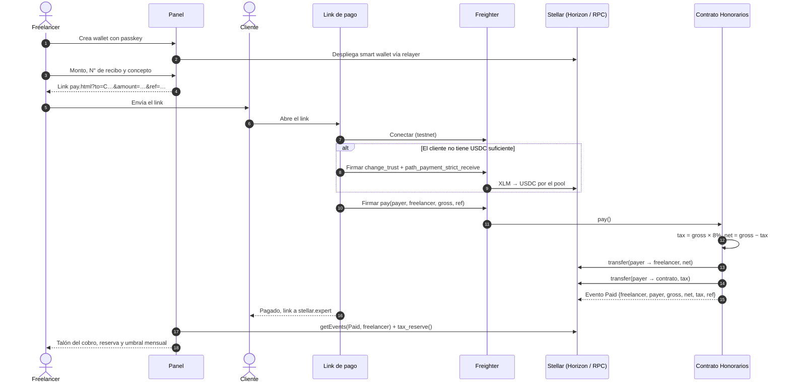
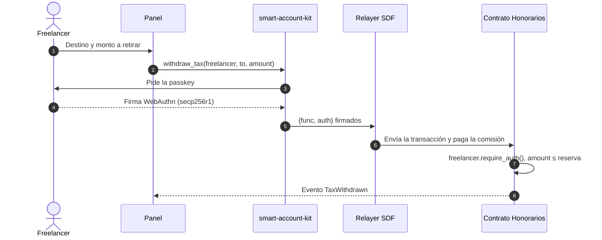

# Honorarios · Arquitectura y flujo

Checkpoint de Stellar Odyssey Perú, 23 de septiembre de 2026.

Honorarios permite que un freelancer peruano cobre a clientes del exterior en USDC sobre Stellar. Un contrato Soroban reparte cada cobro en el momento: 92% al freelancer y 8% en una reserva a su nombre para el pago a cuenta de cuarta categoría (SUNAT). Solo el freelancer puede retirar esa reserva.

## 1. Componentes

```mermaid
flowchart LR
  subgraph Cliente["Cliente en el exterior"]
    F["Freighter<br/>(cuenta G…)"]
    P["pay.html<br/>link de pago"]
  end

  subgraph Freelancer["Freelancer en Perú"]
    PK["Passkey<br/>(huella / Face ID)"]
    SW["Smart wallet OZ<br/>(cuenta C…)"]
    D["index.html<br/>panel"]
  end

  subgraph Stellar["Stellar testnet"]
    POOL["Pool XLM/USDC<br/>(path payment)"]
    USDC["USDC SAC<br/>CBIELTK6…DAMA"]
    H["Contrato Honorarios<br/>CCYLKLKC…DLD5"]
    R["Relayer SDF<br/>paga comisiones"]
  end

  P --> F
  F -- "1. compra USDC con XLM" --> POOL
  F -- "2. pay()" --> H
  H -- "92% neto" --> USDC
  USDC --> SW
  H -- "8% queda en el contrato" --> H
  D -- "lee reserva y eventos Paid" --> H
  PK --> SW
  D -- "withdraw_tax() firmado con passkey" --> R
  R --> H
```

## 2. Flujo de un cobro

## 3. Retiro de la reserva

## 4. Qué vive en la cadena y qué no

| On-chain (Soroban) | Off-chain (navegador) |
|---|---|
| Reparto 92/8 y transferencias de USDC | Link de pago y sus parámetros |
| Reserva por freelancer (`TaxReserve(Address)`) | Tipo de cambio que ingresa el freelancer |
| Eventos `Paid` y `TaxWithdrawn` | Cálculo del umbral mensual de S/ 4,010 |
| Autorización del retiro (`require_auth`) | Sesión de la passkey (IndexedDB) |

El contrato no guarda montos en soles ni tipos de cambio. La regla tributaria que usa es solo la tasa de 8%, porque es la del pago a cuenta de cuarta categoría. El umbral de S/ 4,010 (R.S. 000390-2025/SUNAT) se calcula en el panel con el tipo de cambio que declara el propio freelancer.

## 5. Contrato

| Función | Autoriza | Efecto |
|---|---|---|
| `__constructor(token)` | despliegue | Fija el USDC SAC |
| `pay(payer, freelancer, gross, receipt_ref)` | `payer` | Neto al freelancer, 8% al contrato, emite `Paid` |
| `tax_reserve(freelancer)` | lectura | Saldo reservado |
| `withdraw_tax(freelancer, to, amount)` | `freelancer` | Mueve reserva, emite `TaxWithdrawn` |

Errores: `InvalidAmount` (monto ≤ 0) e `InsufficientReserve` (retiro mayor a la reserva). Cubiertos por 5 tests en `contracts/split/src/test.rs`.

## 6. Evidencia en testnet

| Qué | Enlace |
|---|---|
| Contrato | [CCYLKLKC…DLD5](https://stellar.expert/explorer/testnet/contract/CCYLKLKCXUOO2XSVC7O7HAIOT4CRYBZIS4NBOJATMGL4JOV3DRYUDLD5) |
| Cobro de 500 USDC desde el link de pago | [c2584bac…987f](https://stellar.expert/explorer/testnet/tx/c2584bac1d2b3bedbd3616ed18dcd7267ce5ecc60755ea6c47a9583f496b987f) |
| Smart wallet con passkey | [CCYPK3R3…EYO3](https://stellar.expert/explorer/testnet/contract/CCYPK3R3RARYHSKZBZGMM4434JTNHTF4W7G5ZKXDCPAGKI7ZD375EYO3) |
| Cobro de 200 USDC a la smart wallet | [037b846d…afaf](https://stellar.expert/explorer/testnet/tx/037b846d8ef93c2f5143a7ba028952a39537b5f258e039928dff0d646d6fafaf) |
| Retiro de reserva firmado con passkey | [fd5a33d5…165d](https://stellar.expert/explorer/testnet/tx/fd5a33d5537bef9a1b317b14914a73923afb222fe495f0c67d22a5d504f8165d) |

## 7. Qué falta hasta la entrega (25 de septiembre)

- Borrador del recibo por honorarios con los cobros del mes.
- Video demo y README final.

## Límites conocidos

- `smart-account-kit` y el relayer no tienen auditoría independiente (lo indica su propio README). Uso solo en testnet.
- No encontramos norma de SUNAT específica para honorarios cobrados en cripto. El tipo de cambio lo define el freelancer y la app no lo fija.
- La reserva es una ayuda de organización y no reemplaza a un contador.
