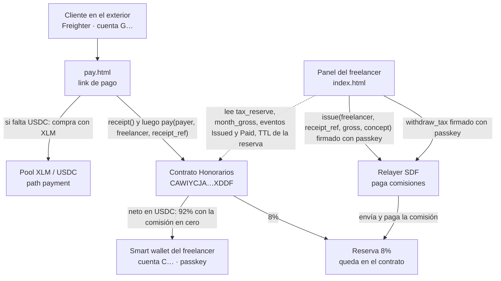
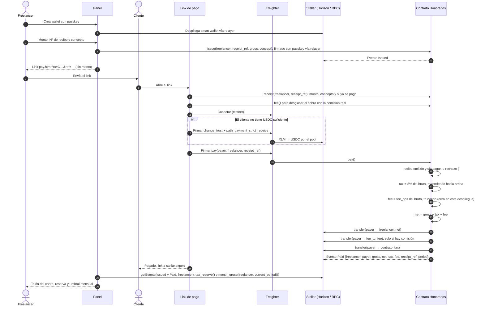
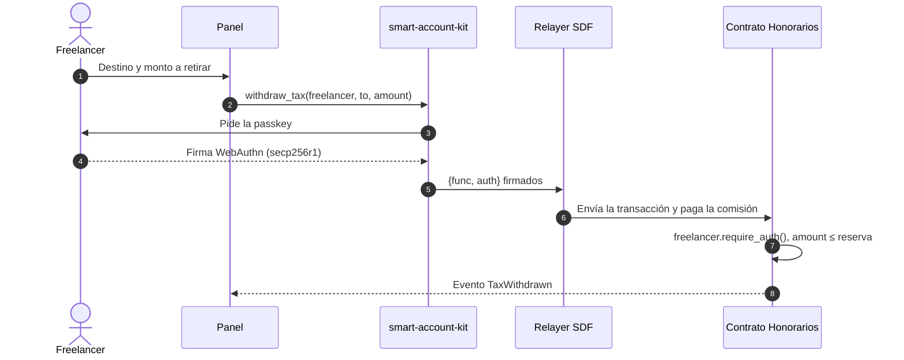

# Honorarios · Arquitectura y flujo

Stellar Odyssey Perú. Última revisión: 24 de septiembre de 2026 (contrato v3, recibos en la cadena).

Honorarios permite que un freelancer peruano cobre a clientes del exterior en USDC sobre Stellar. El freelancer firma cada recibo y lo registra en un contrato Soroban; el cliente solo puede pagar ese recibo, una vez, por el monto registrado. El contrato reparte cada cobro en el momento: 92% al freelancer y 8% en una reserva a su nombre para el pago a cuenta de cuarta categoría (SUNAT). Solo el freelancer puede retirar esa reserva.

## 1. Componentes

## 2. Flujo de un cobro

## 3. Retiro de la reserva

## 4. Qué vive en la cadena y qué no

| On-chain (Soroban) | Off-chain (navegador) |
|---|---|
| Recibos emitidos, con monto, concepto y estado (`Receipt(Address, String)`) | Link de pago: solo destino, N° de recibo y nombre visible |
| Reparto del bruto y transferencias de USDC | Borrador del recibo por honorarios de SUNAT |
| Reserva por freelancer (`TaxReserve(Address)`) | Tipo de cambio que ingresa el freelancer |
| Bruto acumulado del mes (`MonthGross(Address, u32)`) | Comparación contra el umbral y estimación del pago a cuenta |
| Eventos `Issued`, `Paid` y `TaxWithdrawn` | Rentas de cuarta fuera de la app, rentas de quinta y retenciones |
| Autorización del retiro (`require_auth`) | Sesión de la passkey (IndexedDB) |

El contrato no guarda montos en soles ni tipos de cambio. De la norma tributaria solo lleva dentro dos cosas: la tasa de 8% del pago a cuenta de cuarta categoría y el cierre del mes a medianoche de Lima, que es el mes que mide SUNAT. Los umbrales viven en `web/src/tax.ts` y se comparan en el panel con el tipo de cambio que declara el propio freelancer.

Los umbrales mensuales son los del artículo 3 de la R.S. 000390-2025/SUNAT: S/ 4,010 en el régimen general y S/ 3,208 para las rentas del inciso b) del artículo 33 de la LIR, esto es director, síndico, mandatario, gestor de negocios, albacea y regidor. El panel pregunta por ese caso y compara contra el umbral que corresponda. La misma resolución fija los topes anuales para pedir la suspensión, S/ 48,125 y S/ 38,500.

## 5. Contrato

| Función | Autoriza | Efecto |
|---|---|---|
| `__constructor(token, fee_bps, fee_to)` | despliegue | Fija el USDC SAC, la comisión del servicio y la wallet que la recibe. Rechaza una comisión mayor a 1% |
| `issue(freelancer, receipt_ref, gross, concept)` | `freelancer` | Registra el recibo. Un N° se emite una sola vez. Emite `Issued` |
| `receipt(freelancer, receipt_ref)` | lectura | Monto, concepto y si ya se pagó |
| `pay(payer, freelancer, receipt_ref)` | `payer` | Cobra el monto del recibo: neto al freelancer, comisión a `fee_to` si la hay, 8% al contrato. Marca el recibo pagado, suma al acumulado del mes y emite `Paid`. Devuelve el neto |
| `fee()` | lectura | Comisión en puntos básicos y wallet que la recibe |
| `token()` | lectura | Dirección del SAC con el que se cobra |
| `tax_reserve(freelancer)` | lectura | Saldo reservado |
| `month_gross(freelancer, period)` | lectura | Bruto cobrado en ese periodo tributario |
| `current_period()` | lectura | Periodo tributario del ledger actual, en hora de Lima |
| `extend_reserve(freelancer)` | nadie | Renueva el TTL de una reserva inactiva, sin mover fondos. El panel la ofrece cuando le quedan 10 días o menos |
| `withdraw_tax(freelancer, to, amount)` | `freelancer` | Mueve reserva, emite `TaxWithdrawn` |

Errores: `InvalidAmount` (monto ≤ 0, o un bruto tan alto que el 8% desbordaría), `InsufficientReserve` (retiro mayor a la reserva), `InvalidParty` (el freelancer es el pagador o el propio contrato), `ReceiptRefTooLong` (N° de recibo de más de 32 caracteres), `FeeTooHigh` (comisión negativa o por encima del tope de 1%, que solo puede saltar al desplegar), `ReceiptExists` (N° ya emitido), `UnknownReceipt` (nadie emitió ese N°), `AlreadyPaid`, `ConceptTooLong` (más de 80 bytes) y `EmptyReceiptRef`. La reserva, el recibo, el acumulado y la instancia renuevan su TTL a ~30 días en cada operación que los toca. El acumulado del mes (`MonthGross`) es lo que se compara con el umbral de SUNAT, y vive en el contrato para que el panel no dependa de cuántos eventos guarde el RPC. Como solo el freelancer emite recibos, nadie ajeno puede sumar cobros a su mes. Cubierto por 31 tests en `contracts/split/src/test.rs`, cinco de ellos de autorización con el entorno en modo estricto (`set_auths(&[])`, ninguna firma concedida).

## 6. Evidencia en testnet

Contrato vigente: [CAWIYCJA…XDDF](https://stellar.expert/explorer/testnet/contract/CAWIYCJAOXFIL5XHIIXK34XOSLSFTLUU5LP6JEL65QECGZM5WATUXDDF). Los hashes del flujo válido y de los cinco ataques rechazados están en el README y en `evidencias/2026-09-24-contrato-v3/origen.md`.

El video se grabó con el contrato v2, [CCTU5SUS…X3EU](https://stellar.expert/explorer/testnet/contract/CCTU5SUST4I6O5JIO6UHRGI2NW6FHWFNHVRGWPTKCGKCY7Z4X3CMX3EU), anterior al recibo en la cadena. Su corrida sigue verificable: wallet [CATN…J5FR](https://stellar.expert/explorer/testnet/contract/CATNE6YKD72P5OTSW5N6U3SR7AOAQ7R5GQYVX66B6VKV5IDIY6R7J5FR), cobro [4668b6f3…c8f9](https://stellar.expert/explorer/testnet/tx/4668b6f344a715d3cdd3f943ff398873c657241a3fb8ffed1efe4c3efc03c8f9) y retiro con passkey [b47aa15e…d913](https://stellar.expert/explorer/testnet/tx/b47aa15ee86b4df29336159ee89d5fad2b441afae61cf9037eb38d73782d913e).

## Límites conocidos

- `smart-account-kit` y el relayer no tienen auditoría independiente (lo indica su propio README). Uso solo en testnet.
- No encontramos norma de SUNAT específica para honorarios cobrados en cripto. El tipo de cambio lo define el freelancer y la app no lo fija.
- La reserva es una ayuda de organización y no reemplaza a un contador.
