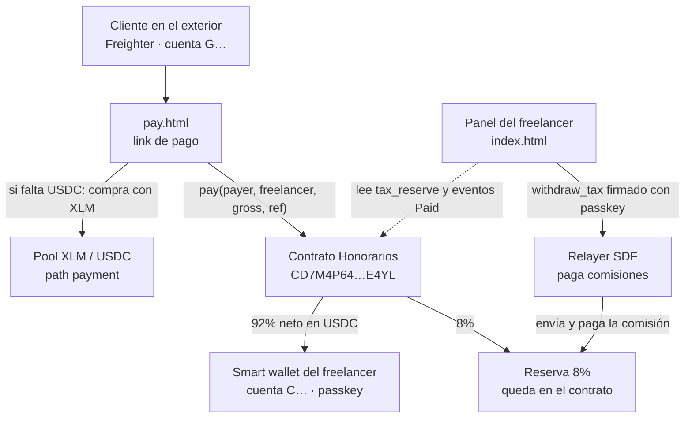
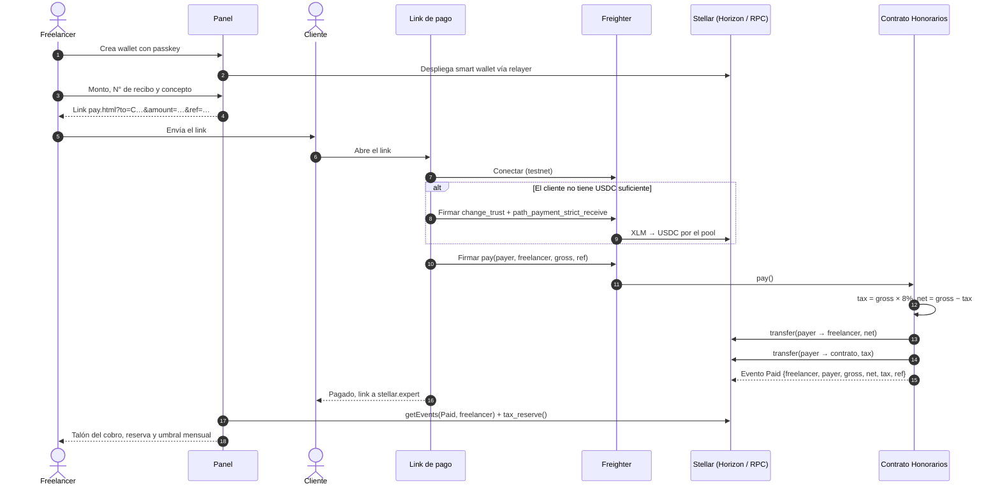
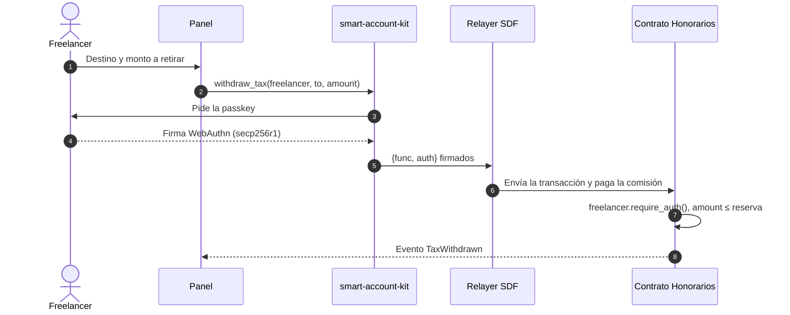

# Honorarios · Arquitectura y flujo

Checkpoint de Stellar Odyssey Perú, 23 de septiembre de 2026.

Honorarios permite que un freelancer peruano cobre a clientes del exterior en USDC sobre Stellar. Un contrato Soroban reparte cada cobro en el momento: 92% al freelancer y 8% en una reserva a su nombre para el pago a cuenta de cuarta categoría (SUNAT). Solo el freelancer puede retirar esa reserva.

## 1. Componentes

## 2. Flujo de un cobro

## 3. Retiro de la reserva

## 4. Qué vive en la cadena y qué no

| On-chain (Soroban) | Off-chain (navegador) |
|---|---|
| Reparto 92/8 y transferencias de USDC | Link de pago y sus parámetros |
| Reserva por freelancer (`TaxReserve(Address)`) | Tipo de cambio que ingresa el freelancer |
| Eventos `Paid` y `TaxWithdrawn` | Cálculo del umbral mensual de S/ 4,010 |
| Autorización del retiro (`require_auth`) | Sesión de la passkey (IndexedDB) |

El contrato no guarda montos en soles ni tipos de cambio. La regla tributaria que usa es solo la tasa de 8%, porque es la del pago a cuenta de cuarta categoría. El umbral de S/ 4,010 (R.S. 000390-2025/SUNAT) se calcula en el panel con el tipo de cambio que declara el propio freelancer.

## 5. Contrato

| Función | Autoriza | Efecto |
|---|---|---|
| `__constructor(token)` | despliegue | Fija el USDC SAC |
| `pay(payer, freelancer, gross, receipt_ref)` | `payer` | Neto al freelancer, 8% al contrato, emite `Paid` |
| `tax_reserve(freelancer)` | lectura | Saldo reservado |
| `withdraw_tax(freelancer, to, amount)` | `freelancer` | Mueve reserva, emite `TaxWithdrawn` |

Errores: `InvalidAmount` (monto ≤ 0), `InsufficientReserve` (retiro mayor a la reserva), `InvalidParty` (el freelancer es el pagador o el propio contrato) y `ReceiptRefTooLong` (N° de recibo de más de 32 caracteres). La reserva y la instancia renuevan su TTL a ~30 días en cada `pay` y `withdraw_tax`. Guarda además el bruto cobrado por mes (`month_gross`), que es lo que se compara con el umbral de SUNAT. Cubiertos por 14 tests en `contracts/split/src/test.rs`, tres de ellos de autorización sin `mock_all_auths`.

## 6. Evidencia en testnet

| Qué | Enlace |
|---|---|
| Contrato | [CD7M4P64…E4YL](https://stellar.expert/explorer/testnet/contract/CD7M4P64BBNWUCTWIGRHFHSRPI3GH2PFREUPAESETG36KCVQODKYE4YL) |
| Despliegue | [bf81a604…88cf](https://stellar.expert/explorer/testnet/tx/bf81a604603564519e1d4af8b3dd366a0dcafbcc258359ddfd7429e877ef88cf) |
| Smart wallet con passkey de la demo | [CCZ2…FJVT](https://stellar.expert/explorer/testnet/contract/CCZ2DVYZXP2PENOEDIFUMK5RXG44TVILVKAGC76XEHYYLRMD4YC5FJVT) |
| Cobro de 500 USDC con compra de USDC vía XLM | [90ab3000…6832](https://stellar.expert/explorer/testnet/tx/90ab3000636518aa5f7936d78770cc432cabb74a2dacabab6f4f90cf893e6832) |
| Retiro de reserva firmado con passkey | [55a1bd3e…2101](https://stellar.expert/explorer/testnet/tx/55a1bd3e256829967120c1ddffd5b76405c5e304689bdc1ca754f0f8154c2101) |

Todos los enlaces salen de la misma corrida, la que se ve en el video demo.

## 7. Qué falta hasta la entrega (25 de septiembre)

- (Hecho) Borrador del recibo por honorarios por cada cobro, para copiar al emitirlo en SUNAT.
- (Hecho) Video demo, README final, acumulado mensual en el contrato y consulta en vivo del ancla de soles.
- Subir el video a YouTube y enviar el formulario de entrega.

## Límites conocidos

- `smart-account-kit` y el relayer no tienen auditoría independiente (lo indica su propio README). Uso solo en testnet.
- No encontramos norma de SUNAT específica para honorarios cobrados en cripto. El tipo de cambio lo define el freelancer y la app no lo fija.
- La reserva es una ayuda de organización y no reemplaza a un contador.
